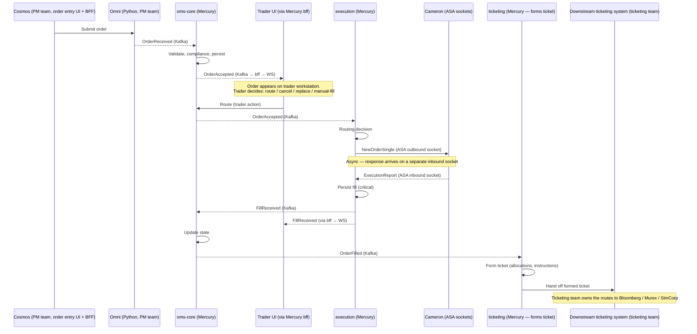
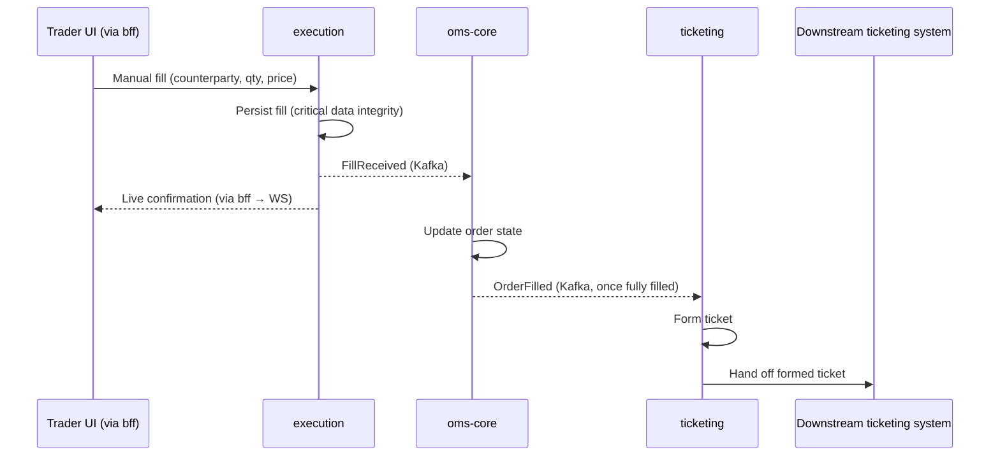

# Mercury — Architecture Decision Document

**Status:** Proposal, open for team discussion
**Scope:** Repository structure, module layout, build tool, and architectural style for Mercury (OMS/EMS rebuild)
**Author:** Sunny (Architect, Mercury)

---

## Contents

1. [TL;DR — What I am asking the team to approve](#1-tldr)
2. [The case for hexagonal architecture](#2-the-case-for-hexagonal-architecture)
   - 2.1 [Why this matters — the C3+ lesson](#21-why-this-matters--the-c3-lesson)
   - 2.2 [What hexagonal architecture is](#22-what-hexagonal-architecture-is)
   - 2.3 [The one rule that matters](#23-the-one-rule-that-matters)
   - 2.4 [Ten concrete benefits for Mercury](#24-ten-concrete-benefits-for-mercury)
3. [Hexagonal in practice — a Mercury walkthrough](#3-hexagonal-in-practice--a-mercury-walkthrough)
   - 3.1 [Mercury and the systems around it](#31-mercury-and-the-systems-around-it)
   - 3.2 [The order lifecycle end-to-end](#32-the-order-lifecycle-end-to-end)
   - 3.3 [Trader actions and alternate flows](#33-trader-actions-and-alternate-flows)
   - 3.4 [Deep dive: the Execution service](#34-deep-dive-the-execution-service)
   - 3.5 [The async-response insight](#35-the-async-response-insight)
   - 3.6 [The same pattern across the other services](#36-the-same-pattern-across-the-other-services)
4. [How we enforce hex — submodules vs packages](#4-how-we-enforce-hex--submodules-vs-packages)
   - 4.1 [The acid test](#41-the-acid-test)
   - 4.2 [Proposal A — Submodules](#42-proposal-a--submodules)
   - 4.3 [Proposal B — Packages only](#43-proposal-b--packages-only)
   - 4.4 [Head-to-head and recommendation](#44-head-to-head-and-recommendation)
5. [Supporting decisions](#5-supporting-decisions)
   - 5.1 [Build tool — Maven vs Gradle](#51-build-tool--maven-vs-gradle)
   - 5.2 [Shared code — the `shared/` hierarchy](#52-shared-code--the-shared-hierarchy)
   - 5.3 [BFF — where it lives](#53-bff--where-it-lives)
6. [The full picture](#6-the-full-picture)
   - 6.1 [Module structure](#61-module-structure)
   - 6.2 [Dependency rules](#62-dependency-rules)
   - 6.3 [Cross-service communication](#63-cross-service-communication)
7. [Objections and responses](#7-objections-and-responses)
8. [Implementation, risks, and decision ask](#8-implementation-risks-and-decision-ask)

---

## 1. TL;DR

| Decision | Recommendation |
|---|---|
| Architectural style | **Hexagonal (ports & adapters)** — strictly enforced |
| Repository layout | Monorepo, all Mercury services in one repo |
| Module structure | **Maven submodules per service × hexagonal layer** (NOT packages only) |
| Build tool | **Maven** |
| Mercury services | `oms-core`, `execution`, `ticketing`, `bff` |
| Modules per service | `*-domain`, `*-application`, `*-adapter`, `*-service` (boot) |
| Shared code | Narrow `shared/` hierarchy with strict inclusion rules |
| Out of Mercury's scope | Cosmos (PM team), Omni (Python, PM team), downstream ticketing system (ticketing team) |

Roughly 20 Maven modules total (4 services × 4 modules + 4 shared modules). This is not large by modern JVM standards — Spring Framework alone ships ~25.

**Ask:** ratify the above in one working session. Move to implementation within a week.

---

## 2. The case for hexagonal architecture

### 2.1 Why this matters — the C3+ lesson

C3+ did not fail because its engineers were careless. It failed because its architecture did not prevent three things from happening gradually over a decade:

1. Business rules bled into framework code. Order validation ended up inside controllers. Lifecycle rules ended up in JPA lifecycle hooks. Compliance checks ended up in Kafka consumer callbacks.
2. Tests became framework-dependent. Every assertion about a business rule required booting the whole container. Test suites got slow. Slow tests get skipped. Skipped tests let regressions through.
3. Technology became impossible to replace. Changing the FIX layer, the database, or the messaging system required rewriting business logic, because the business logic had been tangled up with those technologies.

These three failures compound. Once business logic is tangled with frameworks, tests get slow; once tests get slow, refactoring stops happening; once refactoring stops, coupling accumulates; once coupling accumulates, technology migration becomes a multi-year project — which is where C3+ ended up.

Mercury is the rebuild. Its whole justification — to the business, to Blair, to the people writing the cheques — is that Mercury will avoid C3+'s fate and stay maintainable for 10+ years. That promise is not kept by good intentions. It is kept by an architecture that makes the failure modes structurally impossible.

Hexagonal architecture is that structure. Submodules are what make it real rather than aspirational.

### 2.2 What hexagonal architecture is

Alistair Cockburn's insight (2005): **the business logic (the "hexagon") must not depend on the technologies that surround it.** Dependencies flow inward. Technologies depend on business logic; business logic depends on nothing.

```
                  ┌─────────────────────────────┐
                  │   INBOUND ADAPTERS          │
                  │   REST, Kafka in,           │
                  │   ASA socket in, WebSocket  │
                  └──────────┬──────────────────┘
                             │ calls inbound ports (interfaces)
                             ▼
                  ┌─────────────────────────────┐
                  │   APPLICATION (use cases)   │
                  │   RouteOrder, CancelOrder,  │
                  │   ProcessExecutionReport,   │
                  │   RecordManualFill          │
                  ├─────────────────────────────┤
                  │   DOMAIN (pure business)    │
                  │   Order, Ticket, Fill,      │
                  │   Position, state machines  │
                  └──────────┬──────────────────┘
                             │ calls outbound ports (interfaces)
                             ▼
                  ┌─────────────────────────────┐
                  │   OUTBOUND ADAPTERS         │
                  │   Postgres, Kafka out,      │
                  │   ASA socket out (Cameron), │
                  │   Downstream ticketing      │
                  └─────────────────────────────┘
```

**Vocabulary.**

- **Domain** — the financial concepts themselves. `Order`, `Fill`, `Allocation`, `ExecutionReport`. Pure Java. No Spring, no Jackson, no JPA. An `Order` does not know it will be persisted.
- **Application** — orchestration of domain operations. `RouteOrderUseCase`, `ProcessExecutionReportUseCase`. Defines *ports* (interfaces) for everything it needs from the outside world.
- **Port** — an interface describing what the application offers or needs.
  - *Inbound port:* something the application offers. `RouteOrderUseCase.route(Order)`.
  - *Outbound port:* something the application needs. `OrderRoutingPort.send(Order)`.
- **Adapter** — a concrete implementation that bridges a port to a real technology.
  - *Inbound adapter:* a REST controller, a Kafka consumer, a socket listener — receives input and calls an inbound port.
  - *Outbound adapter:* a Postgres repository, a Kafka publisher, a socket writer — implements an outbound port.

### 2.3 The one rule that matters

**Dependencies point inward. Full stop.**

- Adapters may depend on application and domain.
- Application may depend on domain.
- Domain depends on nothing (except the JDK and `shared-domain-kernel`).
- Nothing in application or domain may import a framework class.

This is the rule that submodules enforce at compile time and packages only enforce by convention. That is why the module structure debate exists — it is really a debate about whether the rule is an invariant or a hope.

### 2.4 Ten concrete benefits for Mercury

People new to hex often hear it as an abstract ideal. It isn't. Every benefit below is something Mercury will cash in, concretely, over the next 10 years.

**1. The domain outlives the technology — by a lot.**
In a 10-year window, we will almost certainly replace or upgrade: our venue connector (Cameron or its successor), our database engine, our messaging backbone, our observability stack, our Spring Boot major version (several times), and our Java runtime (several times). What will *not* change is what an order, a fill, or an allocation means as financial concepts. Hex insulates the slow-changing from the fast-changing. That is the single most valuable property for a decade-plus OMS.

**2. Replacing Cameron becomes a two-file change.**
This is the canonical hex test. If we get the architecture right, swapping Cameron for a different venue connector means changing exactly two files — the inbound and outbound ASA-socket adapters — plus their configuration. If we get it wrong, it means months of hunting Cameron-specific logic through controllers, services, and entities. This single scenario justifies the architecture by itself.

**3. Mercury has many inbound channels, and hex handles multiplicity correctly.**
We have orders from Omni (Kafka), events between Mercury services (Kafka), execution reports from Cameron (ASA inbound socket), trader actions from BFF (REST/WS) — including manually-entered fills from voice trading — and eventually FIX messages from brokers. Each channel is its own inbound adapter.

Different channels usually call **different** use cases, and that is correct — a new order from Omni calls `AcceptOrderUseCase`; a Cameron execution report calls `ProcessExecutionReportUseCase`; a manual fill from the trader UI calls `RecordManualFillUseCase`. Hex does not force unrelated channels through one use case. What it does is enable two specific forms of reuse:

- **Same action, different source → one use case, multiple adapters.** A cancel from the trader UI and a cancel from an ops tool both call `CancelOrderUseCase`. One business operation, multiple inbound channels. No duplicated logic.
- **Different actions, same domain operation → different use cases, convergent domain.** `ProcessExecutionReportUseCase` and `RecordManualFillUseCase` are separate use cases with different preconditions, but both end up calling `Execution.applyFill(...)` in the domain, persisting through the same repository port, and publishing the same `FillReceived` event. The domain rule — "what does it mean to apply a fill to an execution" — is written once.

Either way, business logic is never duplicated per channel. **A Cameron fill and a voice-traded manual fill share zero adapter code, use different use cases, and converge on 100% of the domain logic** — that is exactly the separation hex is designed to deliver.

**4. Mercury has many outbound integrations, and hex isolates each one.**
Cameron, the downstream ticketing system, compliance, position, market data, Postgres, Kafka, metrics. Each is an outbound adapter behind a port. Each can be replaced, mocked, or upgraded independently.

**5. Testability — pure unit tests in milliseconds.**
Domain and application tests run with pure JUnit + Mockito. No Spring context. No Testcontainers. No embedded Postgres. A full domain test run for a service is seconds, not minutes. Across 5,000+ tests this compounds to hours of CI time saved — which is hours of developer wait saved.

**6. Compliance and audit.**
Regulators and internal auditors always ask the same question: "where are the business rules?" Under hex: point to the `domain` and `application` modules. Done. Under layered Spring Boot: "they're spread across controllers, services, entities, and Kafka listeners." Much harder to audit, much harder to certify.

**7. Parallel development.**
Once a port interface is defined, adapter development and domain development proceed in parallel. Domain devs don't wait for Cameron integration; Cameron devs don't wait for business rules to stabilize. The port is the contract, and contracts enable parallel work.

**8. Onboarding flows the right way.**
A new engineer on Mercury reads the `domain` module first — pure Java, pure financial concepts — and learns what the system *is* before learning what it *runs on*. That is the correct teaching order, and it happens naturally when the module structure supports it.

**9. The architecture is the code.**
Under hex + submodules, there is no gap between what the architecture doc says and what the codebase does. The module tree *is* the architecture diagram. Under packages-only, architecture docs drift from the code within weeks.

**10. Cost of change stays roughly constant.**
C3+'s fundamental failure was that every new change cost slightly more than the last, because every new coupling made future changes harder. Hex is specifically designed to prevent that compounding. Over a 10-year system, constant cost-of-change is worth more than any other architectural property.

---

## 3. Hexagonal in practice — a Mercury walkthrough

This section is the concrete example. If the primer above felt abstract, this is where it becomes real.

### 3.1 Mercury and the systems around it

Mercury consists of four services, all hexagonal, all in one monorepo:

| Service | Owner | Responsibility |
|---|---|---|
| `oms-core` | Trading team (us) | Owns the order lifecycle — validation, compliance, state transitions, persistence of order state. Consumes fill events from `execution` and drives ticket formation downstream. |
| `execution` | Trading team (us) | Routes orders to Cameron via its ASA socket connector; receives execution reports on a separate inbound socket. **Also handles manual fills entered by traders for voice trades.** Persists all fills — critical data. Publishes fill events to `oms-core`. |
| `ticketing` | Trading team (us) | **Ticket formation only** — decides how a filled order should be booked (allocations, instructions). Hands the formed ticket to the downstream ticketing system. May surface a ticket-formation UI via BFF (high-level, to be defined). Does **not** own the integrations to the books of record. |
| `bff` | Trading team (us) | Serves the **trader workstation** (decision UI showing Cosmos-originated orders, trader actions: route / cancel / replace / manual-fill) and higher-level Mercury UIs. Built on CPP's micro-UI framework, so components compose with ones owned by other teams. |

**What sits around Mercury — and what we deliberately do not own.**

| System | Team | What it does | Relation to Mercury |
|---|---|---|---|
| **Cosmos** | Portfolio Management | Order entry platform with its own UI and its own BFF. **Portfolio managers enter orders here** — Mercury never originates orders. | Upstream — originates all orders, feeds them into Omni |
| **Omni** (a.k.a. Mercury Omni, Omni API) | Portfolio Management | Python order-ingestion service; not hexagonal | Upstream producer — publishes `OrderReceived` events that `oms-core` consumes |
| **Cameron** | External venue connector (vendor) | ASA socket connector to electronic venues | Integration point for `execution` — two sockets (outbound and inbound) |
| **Downstream ticketing system** | Ticketing team | Takes formed tickets from Mercury and routes them onward: Bloomberg (pricing), Murex (West investment book of record), SimCorp (accounting book of record) | Downstream consumer of `ticketing` — we hand off, they route |
| **Other teams' UIs** | Various | Each team builds its own UI using the shared micro-UI framework | Composition — Mercury BFF's components may be embedded in UIs assembled by other teams, and vice versa |

**Scope discipline.** Mercury's responsibilities stop at **order handling** and **ticket formation**. We deliberately do not own: order entry (Cosmos owns that), ingestion (Omni owns that), or the downstream books-of-record integrations (ticketing team owns those). Drawing these boundaries clearly is itself an architectural decision — it prevents Mercury from becoming a dumping ground for responsibilities that aren't ours.

When this document says "Mercury," it means the four services above. Everything else is an adjacent system.

### 3.2 The order lifecycle end-to-end

This is the primary electronic flow. Real trading is more varied — Section 3.3 covers trader actions including the voice-trade manual-fill case.



Two things worth pausing on:

- The **`Execution ↔ Cameron`** interaction is two separate arrows, not one round-trip. That is deliberate and Section 3.5 explains why.
- **`Ticketing`** hands off to the downstream ticketing system and stops. Bloomberg, Murex, and SimCorp are downstream of *them*, not of us.

### 3.3 Trader actions and alternate flows

**Traders are order handlers, not order originators.** This is a crucial distinction. Portfolio managers enter orders in Cosmos. Mercury is where those orders are *handled*. The trader workstation is a **decision UI**, not an order-entry UI. From it, the trader chooses what to do with each Cosmos-originated order.

| Trader action | Path | Notes |
|---|---|---|
| **Route electronically** | `bff → oms-core → execution → Cameron (ASA outbound)` | Standard electronic path. Fills return on ASA inbound. |
| **Cancel** | `bff → oms-core → execution → Cameron (cancel)` if routed; `bff → oms-core` alone if unrouted | Cancel is applied at the furthest point the order has reached. |
| **Replace** (price/qty amend) | `bff → oms-core → execution → Cameron (cancel-replace)` | Issued as a cancel-replace on the ASA outbound socket. |
| **Manual fill (voice trade)** | `bff → execution → persist fill → publish FillReceived → oms-core` | Order never touched Cameron. Trader was on the phone with a counterparty. |

#### Why manual fills exist

Not every order is executed electronically. Traders frequently work orders over the phone with counterparties — this is especially common for less liquid instruments, block trades, and negotiated prices. When the trader agrees a trade verbally, they enter the fill into the workstation. That fill is just as real as a fill from Cameron: it must be persisted, must update order state, and must flow through to ticket formation.

#### Why this is the cleanest hex example we have

A fill from Cameron and a manual fill entered by a trader have **nothing in common at the adapter level**:

- Cameron fill: bytes arriving on a raw TCP socket, in Cameron's ASA wire format.
- Manual fill: a human filling in fields on a web form, submitted via HTTPS.

They have **everything in common at the domain level**:

- Both are instances of `Fill` in `execution-domain`.
- Both update `Execution` state the same way.
- Both require durable persistence with the same consistency guarantees.
- Both trigger `FillReceived` event publication.
- Both eventually drive downstream ticket formation in `ticketing`.

Hex is what lets us express this cleanly. Two inbound adapters. Two use cases. Same domain.

- `CameronAsaInboundAdapter` → `ProcessExecutionReportUseCase` → `Execution.applyFill(...)` → persist → publish
- `ManualFillInboundAdapter` → `RecordManualFillUseCase` → `Execution.applyFill(...)` → persist → publish

Both use cases converge on the same domain operation (`Execution.applyFill(...)`). The domain does not know — and should not need to know — whether the fill came from a socket or a form. Only the adapters know.

Without hex, fill-handling logic ends up split between "the Cameron path" and "the manual path," and over time those two paths drift. With hex, there is one path in the domain that all fills converge onto. That is the concrete payoff.

#### Manual-fill sequence



Notice the shape: **Cameron is not involved at all.** The order may have been routed and then filled manually when the electronic execution stalled, or it may have gone straight to manual fill without ever being routed. Either way, execution is the authority on fills and all paths converge there.

### 3.4 Deep dive: the Execution service

Execution is the richest example of the hexagon because it owns external connectivity (Cameron), has multiple inbound channels, and deals with async request/response.

#### Modules

| Module | Contents |
|---|---|
| `execution-domain` | `Order`, `Venue`, `RoutingDecision`, `Fill`, `ExecutionReport`, `ExecutionState` (enum + state machine), `ReplaceInstruction`, `CancelInstruction`, domain events. Pure Java. Depends only on JDK and `shared-domain-kernel`. |
| `execution-application` | Use cases and port interfaces. |
| `execution-adapter` | All inbound and outbound adapters. Imports frameworks (Spring, Kafka clients, JPA, the Cameron ASA socket client library). |
| `execution-service` | Spring Boot main, `@Configuration` wiring, `application.yml`, profiles, health checks. Contains no business logic. |

#### Use cases (in `execution-application`)

| Use case | Triggered when | Purpose |
|---|---|---|
| `RouteOrderUseCase.route(Order)` | `oms-core` tells us an order is ready to execute | Make routing decision, send to Cameron |
| `CancelOrderUseCase.cancel(ExecutionId)` | `oms-core` tells us to cancel an active order | Send cancel to Cameron, update state |
| `ReplaceOrderUseCase.replace(ExecutionId, ReplaceInstruction)` | `oms-core` tells us to modify an order (price/qty amend) | Issue cancel-replace to Cameron, update state |
| `ProcessExecutionReportUseCase.process(ExecutionReport)` | Cameron sends us an execution report — fill, partial, reject, bust, or unsolicited update | Update execution state, persist fill, publish `FillReceived` |
| `RecordManualFillUseCase.record(ManualFillInstruction)` | Trader records a voice trade in the workstation | Persist the fill, update execution state, publish `FillReceived` |

Operational use cases also exist (pause/resume routing to a venue, snapshot execution state for ops tooling), but the five above are the business core.

Notice that `ProcessExecutionReportUseCase` and `RecordManualFillUseCase` both culminate in the same domain operation: `Execution.applyFill(...)` followed by persistence and event publication. That convergence is the whole point. The other three use cases operate on different parts of the state machine — `Execution.route(...)`, `Execution.cancel(...)`, `Execution.replace(...)` — because they are genuinely different actions, not the same action over different channels.

#### Ports (in `execution-application`)

| Direction | Port | Purpose |
|---|---|---|
| Inbound | `RouteOrderUseCase` | Receive order-to-route request |
| Inbound | `CancelOrderUseCase` | Receive cancel request |
| Inbound | `ReplaceOrderUseCase` | Receive replace request |
| Inbound | `ProcessExecutionReportUseCase` | Receive execution report from Cameron |
| Inbound | `RecordManualFillUseCase` | Receive manual-fill instruction from trader |
| Outbound | `OrderRoutingPort` | Send order messages to a venue |
| Outbound | `ExecutionRepositoryPort` | Persist and retrieve executions and fills |
| Outbound | `ExecutionEventPublisherPort` | Publish fills and state changes as events |

#### Adapters (in `execution-adapter`)

**Inbound adapters** — each receives from some external source and calls the appropriate use case:

| Adapter | Source | Calls |
|---|---|---|
| `OrderAcceptedInboundAdapter` | Kafka (`mercury.orders.accepted`) | `RouteOrderUseCase` |
| `CancelRequestInboundAdapter` | Kafka (`mercury.orders.cancel`) | `CancelOrderUseCase` |
| `ReplaceRequestInboundAdapter` | Kafka (`mercury.orders.replace`) | `ReplaceOrderUseCase` |
| `CameronAsaInboundAdapter` | **Cameron ASA inbound socket** | `ProcessExecutionReportUseCase` |
| `ManualFillInboundAdapter` | **REST/Kafka (from BFF — trader workstation)** | `RecordManualFillUseCase` |
| `ExecutionOpsController` | REST (ops tooling) | various |

**Outbound adapters** — each implements a port against a concrete technology:

| Adapter | Implements | Concrete technology |
|---|---|---|
| `CameronAsaOutboundAdapter` | `OrderRoutingPort` | **Cameron ASA outbound socket** |
| `PostgresExecutionRepository` | `ExecutionRepositoryPort` | JPA/Postgres |
| `KafkaExecutionEventPublisher` | `ExecutionEventPublisherPort` | Kafka producer |

**The Cameron footprint.** The word "Cameron" appears in exactly two files: `CameronAsaOutboundAdapter` and `CameronAsaInboundAdapter`. Nowhere else in Mercury. If we replace Cameron next year, those two files (plus the socket configuration in `application.yml`) are the total blast radius.

#### Fill persistence — Execution's data-integrity mandate

Of everything `execution` does, **fill persistence is the most important thing it does**, and it deserves to be called out explicitly.

A missing fill means:
- Order state becomes inconsistent with reality (we think the order is still working when it's already done).
- Position data is wrong (downstream risk, P&L, and inventory are corrupted).
- Ticket formation never triggers (downstream booking misses entirely).
- Regulatory reporting is incomplete (compliance breach).

A duplicated fill means:
- Position is overstated.
- P&L is wrong.
- Reconciliation against venues and counterparties breaks.
- Regulatory reporting over-reports.

Both failure modes are genuinely catastrophic in an OMS. `execution`'s persistence layer is therefore held to a higher bar than general state storage:

- **Postgres for the initial implementation** — well-understood ACID guarantees, mature operational tooling, proven at load. Future changes (e.g., to a distributed SQL store) are possible; hex makes them a one-adapter swap.
- **Idempotent writes** keyed on execution-report identity (from Cameron) or client-assigned IDs (for manual fills). Duplicate inbound messages must not produce duplicate fills.
- **Strong consistency** in this path — no eventual-consistency stores.
- **Persist before publish, always.** `FillReceived` is emitted only after the fill is durably persisted. An unpublished but persisted fill is recoverable on restart. A published but unpersisted fill is a phantom that corrupts every downstream state it reaches.

This is one of the places where the hex separation pays off most visibly. The domain rule — "persist before publish, no exceptions" — lives in the use case, which is stable. The adapter (Postgres today, whatever tomorrow) only executes. If we migrate storage in three years, the rule does not move.

### 3.5 The async-response insight

This is the point that trips up almost everyone new to hex, and it's worth dwelling on because it directly shapes how Execution is structured — and because the physical reality of Cameron (two sockets) already mirrors the logical reality (two adapters), which makes it an ideal teaching example.

**The question.** When Execution sends a `NewOrderSingle` to Cameron via `OrderRoutingPort`, that is clearly **outbound** — Mercury initiates, the adapter implements an outbound port, the message goes out on the ASA outbound socket. Fine.

Now Cameron comes back, asynchronously, on the ASA inbound socket, with an `ExecutionReport` (a fill). Is that:

- (a) still part of the outbound conversation — "we asked, now we're getting the answer," or
- (b) inbound — an independent message coming into the hexagon?

**Answer: (b). It is inbound.**

Direction in hex is **not** about who initiated the conversation. It is about the direction of control flow at this moment. When Cameron pushes a message into Execution, something outside the hexagon is causing something inside the hexagon to run — specifically, `ProcessExecutionReportUseCase`. That is the definition of inbound.

The fact that Mercury sent an order earlier is a coincidence from the hexagon's perspective. The hexagon cannot tell, and should not need to tell, whether an incoming `ExecutionReport` is:

- a fill on an order we sent this morning,
- an unsolicited cancel from the venue,
- a bust on a previously-reported fill,
- a status update arriving via a drop copy.

All four are "messages from Cameron that trigger business logic." They are all inbound. The hexagon treats them uniformly, and `ProcessExecutionReportUseCase` is the single place where the meaning of each is decided.

**The practical consequence — which Cameron's wire model already confirms.** Execution has two Cameron adapters, not one:

- `CameronAsaOutboundAdapter` — implements `OrderRoutingPort`, writes to the Cameron outbound socket.
- `CameronAsaInboundAdapter` — listens on the Cameron inbound socket, calls `ProcessExecutionReportUseCase`.

Because Cameron's ASA model uses two physically separate sockets — one for sending, one for receiving — the logical hex structure and the physical wire structure line up exactly. There is no shared session to abstract over. One socket, one adapter, one direction of control flow. Hex makes explicit what the protocol was already telling us: request-response over an async wire is actually two one-way conversations.

**Why this matters.** In non-hex codebases, it is tempting to treat "send an order and handle its fill" as a single request-response flow in a single class. This is how bugs like "what happens if the response arrives after we've already restarted the service" become hidden. Hex forces the team to treat inbound and outbound as independent, which reflects reality, and which makes those bugs visible rather than subtle.

This is not a quirk of our system. It is one of the core insights hex provides — and the reason I keep insisting the team internalize it now, before we start building.

### 3.6 The same pattern across the other services

Every Mercury service uses the same four-module structure. The contents differ:

| Service | Key domain | Main inbound adapters | Main outbound adapters |
|---|---|---|---|
| `oms-core` | `Order`, `OrderLifecycle`, compliance rules | Kafka (from Omni, from execution, from ticketing), REST (ops & trader actions) | Postgres, Kafka publisher, compliance-system client |
| `execution` | `Execution`, `Venue`, `Fill`, routing | Kafka (from oms-core), **ASA inbound socket (from Cameron)**, **REST/Kafka (manual fills from BFF)**, REST (ops) | **ASA outbound socket (to Cameron)**, Postgres, Kafka publisher |
| `ticketing` | `Ticket`, `Allocation`, ticket-formation rules | Kafka (from oms-core), REST (ops and ticket-formation UI) | Handoff to downstream ticketing system, Postgres, Kafka publisher |
| `bff` | UI view models (not Mercury domain objects) | REST/WS from UI | Kafka (subscribes to Mercury events), REST/gRPC clients to Mercury services |

The pattern is invariant across services; only the contents of each layer change.

Note on `ticketing`: the domain is about the *formation* of the ticket — what to book, in which book, with what allocation and instructions. The outbound adapter for the downstream ticketing system is the handoff point. Everything from that handoff onward — Bloomberg, Murex, SimCorp, settlement messaging — is owned by the ticketing team, not by Mercury.

---

## 4. How we enforce hex — submodules vs packages

Two proposals are on the table.

- **Proposal A (mine):** each service is a Maven parent module with four submodules (`domain`, `application`, `adapter`, `service`). Dependency direction is declared in each `pom.xml` and enforced by the compiler.
- **Proposal B (some colleagues):** one Maven module per service. Hexagonal layers are Java packages (`domain.*`, `application.*`, `adapter.*`). Direction is enforced by convention, plus optionally ArchUnit.

### 4.1 The acid test

Most of this debate becomes simple once we ask one question.

Every properly-organised Spring Boot application already has separate packages for different concerns:

| Standard Spring Boot | "Packages-only hex" (just renamed) |
|---|---|
| `controller/` | `adapter/inbound/rest/` |
| `service/` | `application/usecase/` |
| `repository/` | `adapter/outbound/persistence/` |
| `entity/` | `adapter/outbound/persistence/entity/` |
| `dto/` | `adapter/inbound/rest/dto/` |

If "hexagonal with packages only" just means renaming the right column to the left, what have we structurally changed? The `@SpringBootApplication` main class still pulls everything together. Every class still shares the same classpath. `@Autowired` still works everywhere. `@Entity` can still appear anywhere. A class in `application/usecase/` can still directly import a JPA entity from `adapter/outbound/persistence/entity/` — the compiler has no opinion about it.

**Hexagonal is not a naming convention. It is a dependency structure.**

The acid test is a single question:

> **Can the domain code compile without Spring, JPA, Jackson, or any other framework on its classpath?**

| | Standard Spring Boot | Packages-only "hex" | Submodule hex |
|---|---|---|---|
| Package names | `controller/service/repo` | `inbound/application/outbound` | `inbound/application/outbound` |
| Spring on domain classpath | Yes | **Yes** | **No** |
| Can `@Autowired` in domain | Yes | **Yes** | **No** |
| Can `@Entity` in domain | Yes | **Yes** | **No** |
| Dependency direction enforced | No | No (ArchUnit at test time, if wired) | **Compile-time** |
| Framework-free domain tests | No | No | **Yes** |
| What it actually is | Layered Spring Boot | Layered Spring Boot with renamed packages | Hexagonal |

On every row that matters, "packages-only hex" is identical to standard Spring Boot. Only the folder names differ.

By the packages-only logic, every well-organised Spring Boot application in the world is hexagonal — because nearly all of them have controllers, services, and repositories in separate packages. That is obviously not what hex means.

**The implied choice.** If the team genuinely believes packages-only is acceptable, the honest framing is: *"We are writing a well-layered Spring Boot application."* That is a legitimate choice. But then we cannot claim Mercury is hexagonal, and we have to quietly drop the architectural promises (framework-free testing, technology replaceability, domain longevity) that motivated the hex conversation in the first place — because those promises are only cashed in by actually enforcing dependency direction, not by labeling packages.

We can pick one of:

1. **"We are doing hex"** → then we need submodules. That is what doing hex actually looks like.
2. **"We are doing layered Spring Boot"** → fine, but then the broader architectural pitch changes, and we need a different story for why Mercury will avoid C3+'s fate.

What we cannot do is claim (1) while implementing (2). That is how architectural drift starts on day one.

### 4.2 Proposal A — Submodules

**Pros**

1. **Compile-time enforcement.** Domain's `pom.xml` has zero framework dependencies. Spring, Jackson, JPA, Kafka clients simply do not exist on its classpath. `@Autowired` is not a resolvable symbol.
2. **Framework-free tests.** Domain and application tests run as pure JUnit — no Spring, no Testcontainers. Milliseconds, not seconds. Hours of CI time saved over a year.
3. **Clarity for new joiners.** The module tree is the architecture diagram. No doc archaeology required.
4. **Survives team churn.** Contractors rotate; reviewers change; the compiler does not.
5. **Incremental builds more surgical.** Unchanged modules skip rebuild. Domain rarely changes.
6. **Refactoring discipline.** Moving a class across the hexagon requires intention. In an OMS where the domain is the crown jewel, friction at that boundary is a feature.
7. **Clear API surface in every PR.** Adding a new outbound dependency is visible in the pom, not buried in an import statement.
8. **It is actually hexagonal** — see the acid test.

**Cons**

1. Slightly more files when renaming a service. Handled by IDE refactoring.
2. Slightly more decision-making when placing a class. This is a feature: the decisions being forced are ones developers should be making anyway.
3. Cross-cutting changes touch more modules. Rare once the domain stabilizes.

### 4.3 Proposal B — Packages only

**Pros**

1. Fewer `pom.xml` files.
2. Faster initial scaffolding.
3. Easier class relocation during early prototyping.
4. Simpler for developers unfamiliar with multi-module Maven.

**Cons**

1. **Not actually hexagonal.** Structurally identical to standard Spring Boot.
2. **No compile-time enforcement.** First `@Autowired` in a domain class and the boundary is broken. It does not heal.
3. **ArchUnit is only a partial substitute.** Runs at test time, violations still compile, rules must be maintained and can be disabled.
4. **Heavier unit tests.** Framework jars on the classpath regardless of whether they're used.
5. **Boundary erosion is invisible.** Gradual coupling does not surface until someone audits.
6. **Harder release-impact reasoning.** Domain changes and adapter changes are indistinguishable in a PR.

### 4.4 Head-to-head and recommendation

| Criterion | Submodules | Packages |
|---|---|---|
| Actually implements hexagonal | **Yes** | No (renamed Spring Boot) |
| Enforcement mechanism | Compiler | Convention + ArchUnit (optional) |
| Violation detection | Compile time | Test time (or never) |
| Framework leak into domain | Impossible | Possible |
| Unit-test classpath | Minimal for domain/application | Full framework always |
| Onboarding clarity | High (tree = architecture) | Low (doc reading required) |
| Long-term rot resistance | Strong | Weak |
| Fit for a 10-year system | Yes | Degrades |

> **Packages give you a convention. Submodules give you an invariant.**

**Recommendation: submodules.** The cost is a one-time setup. The benefit compounds over 10 years. And it is the only option that actually delivers the architecture we are claiming to adopt.

---

## 5. Supporting decisions

### 5.1 Build tool — Maven vs Gradle

#### Internal CPP precedent

This is not a greenfield choice in isolation. Mercury lives inside CPP's broader trading/post-trade ecosystem:

| System | Build tool |
|---|---|
| **Cosmos (newer order entry)** | Gradle |
| **Older trading systems** | Maven |
| **Post-trade financing (newer rebuild)** | Maven |
| **Mercury (this proposal)** | **Maven** |

Cosmos is the exception, not the precedent. Every other major CPP trading and post-trade system — including the newer post-trade financing rebuild, which is the closest match to Mercury in scope and profile — is Maven. Engineers rotating across CPP trading systems expect Maven; hiring for Maven is easier; shared CI conventions across CPP trading are Maven-shaped. Going Gradle diverges from both the dominant pattern and the most recent precedent in a closely-related context.

#### Maven pros

1. **Declarative XML** is self-describing. Dependencies, plugins, phases all in fixed locations. No scripting needed to understand a build.
2. **Native IntelliJ integration.** First-class import, re-import, dependency resolution. Gradle delegates to its daemon, which is slower to surface errors and harder to debug from inside the IDE.
3. **Convention over configuration** — universal directory layout.
4. **Reproducibility.** Deterministic builds. No "different on Tuesdays" behaviour.
5. **Uniform plugin ecosystem** — SpotBugs, JaCoCo, OWASP, Surefire, Failsafe, enforcer, release — all mature.
6. **Right-sized for our scope.** We are building ~20 standard Java modules. Maven fits; Gradle's flexibility is unused weight.
7. **Stable across CI, local, and IDE.** What runs in IntelliJ runs in Jenkins.
8. **Lower cognitive load across a large team.** Maven has one way to declare a test dependency; Gradle has three (Groovy DSL, Kotlin DSL, imperative tasks).
9. **Version discipline** via `dependencyManagement` + enforcer plugin.
10. **Alignment with CPP's trading-system pattern.**

#### Maven cons

- XML is verbose. Verbosity is the price of declarativeness.
- Marginally slower than Gradle for very large builds. Gap is narrow at 20 modules.
- Less flexible for unusual build steps. We have no unusual build steps.

#### Gradle pros (claimed)

1. Faster incremental builds and build caching — **in theory**. See the next subsection.
2. Kotlin DSL offers type-safe scripts.
3. Imperative escape hatches.
4. Preferred for polyglot / Android / native projects — none of which apply to us.

#### Why Gradle's speed advantage does not apply to us

The "Gradle is faster" claim is the most commonly cited pro, and it deserves to be examined on its own because it is the bookish argument. In our actual workflow, the advantage fades to near-zero.

- **CI/CD runs full builds, not incremental.** Our pipelines build from a clean checkout on every run. Gradle's incremental-build advantage does not apply to a cold build. At 20 modules, full builds are comparable.

- **In the IDE, the IDE does incremental compilation itself.** This is the point that most people miss. When a developer edits a Java file in IntelliJ, IntelliJ's own incremental compiler recompiles that file and its dependents — neither Maven nor Gradle is involved in the edit-compile-edit loop. The build tool is only invoked when the developer explicitly builds, tests, or packages. With **Maven's native IntelliJ integration, that invocation runs in-process in the IDE** — fast, immediate error surfacing, integrated with the IDE's own indices. With Gradle, it goes through the Gradle daemon, which is a separate JVM; errors surface more slowly, daemon warm-up is a noticeable cost, and when something breaks it is harder to debug because the IDE is not running the build directly.

- **Build caching only helps when caches hit.** Remote build caches shine in very large organisations with hundreds of engineers sharing artifacts across a trusted cache. For a team of our size building in a standard CI setup, cache hit rates are modest and the extra infrastructure is not free.

- **The scenarios where Gradle is meaningfully faster** — polyglot repos with 1000+ modules, Android builds, native compilation, sophisticated remote caching — are not our scenarios.

**Felt developer experience is what matters.** Developers feel speed in the IDE, not in CI logs. Maven + IntelliJ is at least as fast as Gradle + IntelliJ on our workload, and often faster because error surfacing is more immediate. "Faster builds" is a theoretical win in our context, not a practical one — which is exactly the kind of claim that does not justify diverging from CPP's dominant build-tool convention.

#### Gradle cons

1. **Scripts become programs.** Over 10 years, accumulated conditional logic is hard to audit.
2. **Two competing DSLs** (Groovy and Kotlin) split teams and complicate migration.
3. **IntelliJ integration via the daemon** — slower feedback, harder debugging.
4. **Steeper learning curve** — "how do I add a dependency" has multiple correct answers.
5. **Version upgrades break builds** more often than Maven version upgrades.
6. **Plugin ecosystem less uniform** in quality.
7. **Style drift** across a large team.
8. **Diverges from CPP's dominant Maven pattern.**

**Recommendation: Maven.** We have no need for Gradle's flexibility, strong need for Maven's transparency and IntelliJ integration, and clear alignment with CPP trading conventions. The speed argument — the one argument that might have carried weight — does not survive contact with how developers actually use the tool.

### 5.2 Shared code — the `shared/` hierarchy

Real systems have shared code. State machine primitives, event schemas, value objects (`Money`, `Isin`, `OrderId`), and common adapter plumbing are legitimately reused. The risk is that `shared/` becomes a dumping ground — this is how many platforms rot.

#### Proposed structure

```
shared/
├── shared-domain-kernel/     ← pure Java value objects, IDs, enums
├── shared-events/            ← Avro/Protobuf event schemas (generated classes)
├── shared-state-machine/     ← generic state machine interfaces & base classes
└── shared-adapter-kit/       ← common Kafka, socket, REST client plumbing
```

#### Contents

- **`shared-domain-kernel`** — value objects (`Money`, `Currency`, `Isin`, `Cusip`, `OrderId`, `TicketId`), fundamental enums (`Side`, `OrderType`, `TimeInForce`, `Venue`). Pure Java, no annotations, JDK only.
- **`shared-events`** — event schema definitions and generated Java classes. No hand-written logic. Schemas are the source of truth.
- **`shared-state-machine`** — generic `StateMachine<S,E>`, `Transition<S,E>`, abstract base classes. Pure Java. Service-specific state machines (order lifecycle, execution lifecycle) live in the service's own domain module and use these primitives.
- **`shared-adapter-kit`** — common Kafka consumer configuration, socket-session helpers (applicable to ASA and any other socket-based connectors), REST client configuration (timeouts, TLS, tracing, circuit breakers). Framework imports are allowed here — this is the adapter layer.

#### Inclusion rules

A class goes in `shared/` **only if all** of the following are true:

1. It is used by at least two services **today** (not "might be in future").
2. It has low change frequency (weeks/months between changes, not days).
3. It is not service-specific business logic in disguise.
4. It respects the hexagonal layer of its containing module (`shared-domain-kernel` has no framework deps; `shared-adapter-kit` may).
5. A change to it is safe across all consumers — or all consumers can be updated together in the same PR.

**Explicitly disallowed:** service-specific DTOs, "just handy" utilities, anything used by one service today, anything likely to need service-specific variation within a year.

#### Governance

- New classes in `shared/` require architect sign-off on the PR.
- Duplication is preferred over premature sharing.
- Quarterly review; prune anything that has only one consumer.

### 5.3 BFF — where it lives

**Same monorepo. Top-level module. Same hex structure as other services. Deployed independently.**

#### Why same monorepo

1. **Atomic cross-cutting changes.** When `oms-core` changes an event schema, BFF often needs to change too. Atomic PRs are gold; cross-repo PRs are a coordination tax.
2. **Single source of truth for schemas.** BFF consumes `shared-events`. Monorepo means it uses the exact published version, never a lagging copy.
3. **Single CI pipeline.** One pipeline that knows how to build and test everything. Independent deployment still works — CI/CD publishes per-service artifacts.
4. **Unified tooling** — Maven, code style, CI, observability.
5. **Easier refactoring.** Renaming a domain concept that propagates to BFF is one PR, not a saga.

#### Why not a separate repo

The typical arguments — different release cadence, different ownership — are weaker here. Mercury is one team. Release cadence is a deployment concern, not a source-layout concern. And BFF contracts are *tightly* coupled to Mercury's internal events; separating source just hides the coupling without removing it.

#### BFF hex notes

- `bff-domain`: view models (`TraderBlotterRow`, `OrderSummaryView`, `PositionSnapshot`) — UI-shaped projections, not Mercury domain objects.
- `bff-application`: aggregation use cases (`GetBlotterForTrader`, `StreamLiveUpdates`, `SubmitTraderAction`).
- `bff-adapter`: inbound WS/REST from UI; outbound Kafka consumers and REST/gRPC clients to Mercury services (oms-core for order actions, execution for manual fills).
- `bff-service`: Spring Boot main, WS config, auth wiring.

#### The micro-UI framework

CPP uses a shared micro-UI framework across teams — different teams build UI components that compose into larger screens assembled across departments. Mercury's BFF serves components into that framework. This means:

- Mercury's BFF is not a single-UI backend; it is a components-producer that plays in a shared UI space.
- Cosmos has its own BFF, serving order-entry components. Mercury's BFF serves trading and execution views (and potentially ticket-formation views). Composition happens at the UI layer, across teams.
- The BFF hex structure is unaffected by this — view models, aggregation use cases, and outbound clients to Mercury services are all internal concerns. The micro-UI framework is a consumer of the BFF's outputs.

BFF has no direct access to Mercury's databases. It consumes events and calls APIs — same as any external consumer would.

---

## 6. The full picture

### 6.1 Module structure

```
mercury/                                  ← monorepo root (parent pom)
├── pom.xml                               ← parent, dependencyManagement, plugin pinning
│
├── shared/
│   ├── shared-domain-kernel/
│   ├── shared-events/
│   ├── shared-state-machine/
│   └── shared-adapter-kit/
│
├── oms-core/
│   ├── oms-core-domain/
│   ├── oms-core-application/
│   ├── oms-core-adapter/
│   └── oms-core-service/
│
├── execution/
│   ├── execution-domain/
│   ├── execution-application/
│   ├── execution-adapter/                ← Cameron ASA adapters + ManualFillInboundAdapter
│   └── execution-service/
│
├── ticketing/
│   ├── ticketing-domain/
│   ├── ticketing-application/
│   ├── ticketing-adapter/                ← downstream-ticketing handoff adapter
│   └── ticketing-service/
│
└── bff/
    ├── bff-domain/
    ├── bff-application/
    ├── bff-adapter/
    └── bff-service/
```

Cosmos, Omni, and the downstream ticketing system are **not** in this tree — they are owned by other teams.

### 6.2 Dependency rules

| Module | May depend on |
|---|---|
| `*-domain` | `shared-domain-kernel` only. No framework. |
| `*-application` | Its own `*-domain`, `shared-domain-kernel`, `shared-state-machine`. Defines ports. |
| `*-adapter` | Its own `*-application` and `*-domain`, `shared-events`, `shared-adapter-kit`. Imports frameworks. |
| `*-service` | All three siblings. Spring Boot main, configuration, wiring. No business logic. |
| `shared-domain-kernel` | JDK only. |
| `shared-events` | Schema-generator output only. |
| `shared-state-machine` | JDK only. |
| `shared-adapter-kit` | Framework allowed. |

### 6.3 Cross-service communication

- Services communicate via published events (`shared-events`) and REST/gRPC — **never** by depending on each other's modules.
- There is no `oms-core-domain` on `execution-adapter`'s classpath. If Execution needs to know about an order, it consumes an event and maps it to its own local representation.
- The same rule applies to inter-team boundaries: Mercury does not depend on Cosmos or Omni code, and the downstream ticketing system does not depend on Mercury code. Events and published contracts are the only crossings.

---

## 7. Objections and responses

**"Maven submodules are complex."**
False at our scope. Four modules per service is boilerplate. Complexity in a codebase comes from *dependencies*, not pom count. Hiding dependencies inside one module does not simplify them; it obscures them. Every major Java library we use — Spring, Spring Boot, Jackson, Hibernate — is multi-module. If it were genuinely complex, the ecosystem would have abandoned it.

**"Packages with good naming are already hexagonal."**
The most important objection, because it's often believed sincerely. Every well-organised Spring Boot app has separate packages for controllers, services, repositories, entities. Renaming them to `adapter/inbound`, `application`, `adapter/outbound`, `adapter/outbound/entity` changes nothing structurally — same classpath, same `@Autowired` availability, same ability for any class to import any framework. By this logic every well-organised Spring Boot app is "hexagonal," which is obviously wrong. The acid test (Section 4.1) settles this: under submodules the domain can compile without frameworks; under packages-only it cannot. That is the whole difference.

**"Packages + ArchUnit is enough."**
ArchUnit is defense-in-depth, not a substitute. It runs at test time, violations still compile, rules must be maintained, and the framework remains on the classpath. Use it *in addition to* submodules for intra-module rules — not instead of them.

**"Gradle is faster."**
In theory, not in our workflow. CI does full builds (no incremental benefit). In the IDE, IntelliJ handles incremental compilation itself, not the build tool. Build caching helps at much larger scales than ours. Maven's native in-process IntelliJ integration surfaces errors faster than Gradle's daemon-mediated one. See Section 5.1 for the full argument.

**"Cosmos uses Gradle, so we should too."**
Cosmos is one team's choice in a narrower domain. The post-trade financing rebuild — a newer project closer to Mercury's profile — chose Maven. The closer reference point goes the other way.

**"XML is ugly."**
Aesthetics are not a decision criterion. Declarative XML is unambiguous, diffable, and readable without learning a DSL. That is its job.

**"Hexagonal is overkill for simple services."**
No Mercury service is simple. Execution alone has five distinct use cases — route, cancel, replace, process electronic execution reports, record manual voice-trade fills — driven from several inbound channels (Kafka from `oms-core`, the Cameron ASA inbound socket, REST from the trader UI). Some of these converge on the same domain operation (both fill use cases call `Execution.applyFill(...)`); others operate on different parts of the state machine. That is exactly the scenario hex is designed for: keep channels isolated at the adapter boundary, share what is genuinely common in the domain, keep what differs separate. Adding hex after the fact is strictly more expensive than having it from day one.

**"What if we need Gradle's flexibility later?"**
Migrate if a real need emerges. The cost of migration later is smaller than the cost of paying for unused flexibility now. YAGNI applies to build tools.

---

## 8. Implementation, risks, and decision ask

### 8.1 Implementation effort

| Task | Effort |
|---|---|
| Parent pom (dependencyManagement, plugin pinning, profiles) | 0.5 day |
| `shared/` scaffolding (4 submodules) | 1 day |
| `shared-events` schema generation pipeline | 1 day |
| Per-service scaffolding (4 submodules × 4 services) | 2 days |
| Enforcer rules (dependency convergence, Java version, no-snapshot in release) | 0.5 day |
| ArchUnit baseline rules (intra-module) | 0.5 day |
| CI pipeline (multi-module build + per-service deploy artifacts) | 1.5 days |
| **Total** | **~6.5 days, one engineer** |

One-time cost, amortized over 10+ years.

### 8.2 Risks of not doing this

1. **We claim hex but deliver layered Spring Boot.** All the architectural promises (testability, replaceability, longevity) are undelivered. The pitch to Blair and leadership becomes inaccurate.
2. **Architectural erosion is near-certain.** First `@Autowired` in a domain class and the boundary is broken. It does not heal.
3. **Test suite becomes slow and flaky.** Framework on every test's classpath. Contexts creep into tests that shouldn't need them.
4. **Fill-handling logic splits.** Without hex, the Cameron fill path and the manual fill path end up in different places and drift. Over time, they produce subtly different order states for identical inputs — a catastrophic failure mode in a trading system.
5. **Refactoring becomes expensive.** Restoring boundaries later means fighting a decade of accumulated coupling.
6. **Mercury becomes C3+ v2** — the exact failure mode we are rebuilding to avoid.

### 8.3 What I am asking the team to approve

1. **Hexagonal architecture**, enforced structurally — not just labeled.
2. **Monorepo** containing all four Mercury services.
3. **Four Maven submodules per service** (`domain`, `application`, `adapter`, `service`).
4. **`shared/` hierarchy** with four tightly-scoped modules and governance rules.
5. **BFF** in the same monorepo as a top-level module, deployed independently, serving components into the CPP micro-UI framework.
6. **Maven** as the build tool, aligning with CPP's trading-system pattern.
7. **Clear scope boundaries.** Omni and Cosmos are upstream (PM team); the downstream ticketing system is downstream (ticketing team); Mercury owns `oms-core`, `execution` (electronic and manual fills), ticket *formation*, and trader-facing BFF.
8. **Execution owns fill persistence** — the single source of truth for all fills, electronic or manual. Held to a strict data-integrity standard: idempotent writes, strong consistency, persist-before-publish.
9. **ArchUnit** as defense-in-depth for intra-module rules only.
10. **No inter-service or inter-team module dependencies.** All crossings go through published events and APIs.

### 8.4 Next step

A single two-hour working session to ratify this document — or counter it with specific technical objections annotated against specific sections. Further debate without a decision is itself a cost; I would like us to move to implementation within a week.

---

*Document open for comment. Annotate specific sections rather than raising general objections — the point of this document is to make any disagreement precise.*
